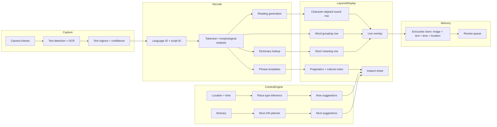
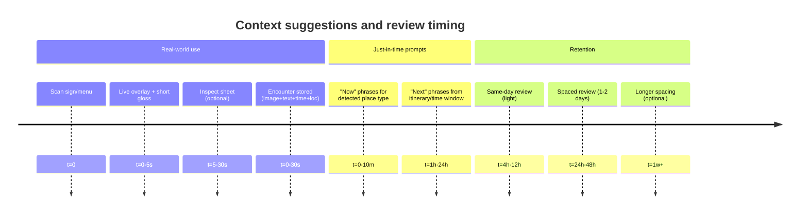

# Evidence-Based Learning Models and Product Design for a Context-Aware Offline Travel Language Lens

## Executive summary

A camera-based travel language app can be meaningfully differentiated from generic translation tools by treating “translation” as **structural decoding** plus **situational pragmatics**: show how text works (character→sound→word→meaning) and what to say/do appropriately in the immediate context. Evidence across instructed SLA, cognitive load theory, contextual learning, and intercultural/pragmatics instruction supports five product imperatives.

First, sustained learning gains come primarily from **high-volume meaningful exposure** and repeated encounters with language-in-use; product design should privilege fast comprehension and repeated real-world exposures over long explanations. citeturn0search0turn11search3turn12search9turn12search10

Second, your layered representation should explicitly minimize **extraneous cognitive load** by avoiding split attention and by segmenting and cueing structure; this strongly supports your “stacked rows aligned under characters” format and progressive disclosure. citeturn1search0turn1search1turn1search6turn1search22

Third, learners benefit when they are helped to **notice** forms and build reliable form–meaning mappings; interactive structural overlays and “tap to reveal” layers are a direct productization of noticing- and input-processing informed instruction. citeturn0search1turn8search33turn8search3

Fourth, retention and usability improve when the product supports **spaced retrieval and repetition**; history, “encounters,” and lightweight review loops are evidence-aligned and subscription-appropriate. citeturn5search15turn5search23turn5search7

Fifth, travelers’ real failures are often **pragmatic/cultural** rather than lexical; explicit, scenario-based micro-guidance improves pragmatic competence and intercultural effectiveness, supporting your “cultural lens” layer and context engine (location/time/itinerary). citeturn10search2turn10search0turn4search1turn12search9turn2search2

## Prioritized actionable principles

### Productizable learning principles

**Exposure first, explanation second.** Design for rapid access to comprehensible language-in-use, because meaningful exposure is a major driver of acquisition and reading-based gains (especially when materials are level-appropriate). Product implication: default UI should prioritize immediate readability and “keep moving” flow, with deeper layers optional. citeturn0search0turn11search3turn12search9turn12search10

**Minimize split attention; integrate corresponding information spatially.** When learners must bounce between separate text blocks (Japanese far away from reading/meaning), extraneous load increases; integrated displays reduce cognitive load and improve learning outcomes in many instruction formats. Product implication: align each unit’s sound/role/meaning directly beneath it; avoid detached romaji strings and detached gloss boxes as the primary view. citeturn1search1turn1search6turn1search22turn8search28

**Segmenting and user-controlled pacing beat continuous dense displays.** Segmenting complex material into manageable parts with user control improves learning; working memory capacity for novel material is limited to only a few chunks, reinforcing “small bites” and progressive disclosure. Product implication: show 1–2 short lines or one sign at a time by default; expand on tap; avoid “translate the whole frame into paragraphs.” citeturn1search22turn1search19turn1search3turn1search11

**Support noticing and form–meaning mapping, not just output.** Noticing-based accounts argue that attended forms become intake more reliably, and input-processing research shows learners often prioritize meaning and miss grammatical cues unless guided. Product implication: lightly cue salient forms (particles, polite endings, counters) and provide “role labels” on demand; emphasize receptive decoding in the camera loop. citeturn0search1turn8search33turn8search17

**Glossing works—but presentation format matters.** Research on glossed reading shows improved vocabulary learning relative to no glosses, and meta-analyses suggest differences by gloss type and placement; poor formats can increase cognitive load. Product implication: prefer integrated/near-text glossing and interactive reveal rather than distant glossaries; provide short L1 meanings by default with deeper notes optional. citeturn8search1turn8search0turn8search2turn8search28

**Spaced practice and retrieval improve long-term retention in L2 learning.** Meta-analytic and experimental work supports spacing and repeated retrieval benefits for vocabulary and language learning. Product implication: “encounters history” + spaced review is not ancillary; it is a core learning engine and a subscription lever. citeturn5search15turn5search23turn5search7turn5search11

**Situated/context-aware learning is effective when it links real-world contexts to prompts.** GPS- and context-aware learning studies show benefits when learning tasks are tied to locations and authentic targets; systematic work in mobile/seamless learning emphasizes bridging formal/informal learning. Product implication: location- and itinerary-based “next best phrases” is evidence-aligned, especially if it stays lightweight and task-focused. citeturn2search2turn2search6turn2search14turn2search18

**Pragmatics instruction has large effects; cultural competence is teachable.** Research syntheses and meta-analyses in L2 pragmatics show instruction improves pragmatic competence substantially; intercultural competence models emphasize knowledge, skills, and attitudes that can be cultivated through guided reflection and practice. Product implication: deliver micro “what’s appropriate here” guidance alongside phrases (politeness level, indirectness, norms), explicitly labeled as pragmatics. citeturn10search0turn10search2turn4search1turn4search0

**Formulaic language matters for “passing” as local.** Work on formulaic sequences and conventional expressions supports the idea that socially appropriate, high-frequency routines improve fluency and pragmatic success. Product implication: prioritize conventional phrases by situation (restaurant, shrine, transit) and teach variants (neutral/polite/very polite) as “routines,” not as isolated words. citeturn11search1turn11search2turn11search15

### Comparative table of methods and their product implications

| Learning method | Evidence base (selected) | Best product use | Primary risk | Design mitigation |
|---|---|---|---|---|
| Comprehensible input / meaning-first exposure | Reading and CI-oriented evidence; extensive reading syntheses show positive effects citeturn0search0turn12search10turn12search9 | Default camera loop optimized for rapid comprehension; keep user “in the world” | If too hard, users disengage | “Easiest-first” mode; limit output length; confidence gating citeturn12search9turn1search22 |
| Structured input / processing instruction | Meta-analysis and foundational studies show strong receptive gains; structured input often drives benefits citeturn8search3turn8search33turn8search17 | Tap-to-reveal role labels; particle/politeness cues; “why this means that” in small bites | Over-explaining increases load | Progressive disclosure; one rule at a time citeturn1search6turn1search22 |
| Glossed reading / annotation | Glossed reading improves vocabulary learning; gloss type and placement matter citeturn8search1turn8search0turn8search5 | Character/word meaning overlays; “peek” definitions | Split-attention and redundancy | Integrated placement; avoid duplicate long text citeturn1search1turn1search14turn8search28 |
| Spacing + retrieval | Spacing and retrieval improve long-term retention in L2 vocabulary and learning citeturn5search15turn5search23turn5search7 | Encounters history → review queue; “you saw this 3×” prompts | Annoying reminders | Opt-in review; quiet defaults |
| Situated/context-aware mobile learning | GPS/context-aware studies show gains; seamless learning designs support authentic contexts citeturn2search2turn2search6turn2search14 | Context engine: now/next phrases, etiquette microcards | Wrong context inference | User-confirmed “place type” + fallback packs |
| Pragmatics + intercultural competence | Pragmatics instruction yields large effects; ICC frameworks emphasize teachable components citeturn10search0turn10search2turn4search1turn4search0 | Cultural lens notes: politeness, norms, what to ask | Sounding prescriptive or stereotyped | “Common patterns” + disclaimers + regional variability tags |

## Recommended UI/UX rules

### Layered structural display rules

**A layered display is mandatory for every recognized text span.** Each span must support these layers (collapsed by default, user-controlled):  
Original → Character sound → Word grouping → Meaning → Cultural/pragmatic note. This is a direct application of segmentation, signaling, and split-attention reduction principles. citeturn1search22turn1search6turn1search1turn8search28

**Contiguity rule.** Any annotation (sound/meaning/role) must be spatially contiguous with the unit it annotates (directly under, not in a distant panel) unless screen constraints force an overflow. citeturn1search6turn1search1turn1search22

**One primary task per screen.** Live camera view is for decoding in motion; deeper explanation belongs in an inspect sheet that still preserves structural alignment (not long paragraphs). This reduces extraneous load and supports user-controlled pacing. citeturn1search6turn1search22turn1search0turn1search19

**Default to short meanings.** Glossing improves learning, but longer notes can increase load; the default translation should be short and literal, with “natural English” and cultural notes on demand. citeturn8search1turn8search2turn1search14

**Role labels are optional but standardized.** When enabled, show micro-labels for high-value grammar roles (topic marker, question particle, polite copula). This operationalizes noticing and input-processing-informed guidance without forcing grammar lessons. citeturn0search1turn8search33turn8search17

### Glossing and overlay interaction rules

**Prefer “tap-to-reveal” over always-on density.** Dynamic reveal supports segmentation and learner control and reduces redundancy. citeturn1search22turn1search14turn8search32

**Avoid popovers that cover text in the primary reading plane.** Popups increase visual search and split attention; use inline expansion or a bottom sheet that repeats the aligned structure. citeturn1search1turn8search28turn8search32

**Use signaling cues, not decoration.** Cues that highlight structure improve learning; implement with minimal color/weight changes (e.g., subtle highlight of the selected token and its aligned rows). citeturn1search6turn1search22

### Progressive scaffolding rules

Build a three-level scaffold (user-selectable, with optional automatic fading based on mastery):

| Level | On-screen default | Trigger to fade support |
|---|---|---|
| Beginner | Character sound + word grouping + short meaning | High recognition confidence + successful reviews (spaced) citeturn5search15turn5search23 |
| Intermediate | Word grouping + short meaning (character sound on tap) | Reduced lookup rate + stable recall citeturn5search11turn5search7 |
| Advanced | Original text only (meaning on tap) | User-controlled |

This aligns with limited working memory capacity for novel units (few chunks) and the value of controlled segmentation. citeturn1search19turn1search11turn1search22

### Context engine UX rules

**Context suggestions must be “assistive, not predictive-only.”** Context-aware learning literature supports location-linked prompts, but misclassification harms trust. Always provide a quick override (“I’m at a restaurant / shrine / station”). citeturn2search2turn2search6turn2search14

**Time horizon windows.** Provide “Now” (immediate phrases) and “Next” (within 2–24 hours) suggestions to align with just-in-time/performance support design and itinerary planning constraints. citeturn5search16turn5search22turn2search6

## Feature mappings from research to product

### Mapping table

| Research finding | Practical interpretation | Product feature |
|---|---|---|
| Integrated displays reduce split attention and extraneous load citeturn1search1turn1search6turn8search28 | Keep related info together | Character-aligned rows; avoid detached romaji and distant gloss lists |
| Segmenting + learner control improves learning citeturn1search22turn1search6 | Small steps, user-paced | Tap-to-expand layers; “freeze frame” inspect; short default meanings |
| Glossed reading improves vocabulary learning; format matters citeturn8search1turn8search0turn8search5 | Provide easy access to meaning during reading | Inline/near-text meaning; optional L2 notes; “peek” interactions |
| Structured input (processing-instruction informed) improves receptive mapping citeturn8search33turn8search3turn8search17 | Guide form→meaning attention during comprehension | Particle/ending micro-labels; “why does か make it a question?” snippets |
| Spacing and retrieval enhance long-term retention citeturn5search15turn5search23turn5search7 | Learning requires revisit | Encounters → review queue; “seen again” counters; scheduled offline reviews |
| Context-aware learning supports authentic, situated tasks citeturn2search2turn2search6turn2search14 | Tie prompts to places and tasks | Location-based phrase packs; itinerary-driven “tomorrow” cards; map of encounters |
| Pragmatics instruction yields large gains citeturn10search0turn10search2 | Teach what to say appropriately | Cultural lens notes; politeness variants; “common misunderstandings” microcards |
| Intercultural competence has definable components and can be assessed citeturn4search1turn4search0 | Build structured cultural guidance | “Respectful defaults”; reflection prompts; checklist-based etiquette guidance |
| Formulaic sequences and conventional expressions support fluency and appropriateness citeturn11search1turn11search2turn11search15 | Teach routines, not just words | Situation phrase sets; “polite routine slots” (requesting, refusing, thanking) |

### System components diagram

Support for integrated overlays and segmented expansion is aligned with cognitive load principles; context-aware prompts align with situated learning findings. citeturn1search6turn1search22turn2search2turn2search6

## Implementation considerations

### Offline-first constraints and feasible language tooling

**On-device OCR is practical.** The iOS Vision text recognition API (VNRecognizeTextRequest) provides a device-side path to extracting text spans from camera frames and still images, supporting an offline-first reader loop. citeturn6search0turn6search3turn6search17

**Tokenization for non-spaced scripts must be deliberate.** Apple’s Natural Language tokenization APIs exist to handle scripts where whitespace is not reliable; Japanese word segmentation still often benefits from dedicated morphological analyzers for high-quality readings and lemmas. citeturn6search1turn6search5turn7search1turn7search4

**Dictionary-first meaning is the most offline-feasible baseline.** For offline operation, a high-quality lexical database (e.g., JMdict) supports quick glosses and common phrases without heavy neural translation. Licensing must be validated and attribution displayed. citeturn6search2turn6search6turn6search9

**Offline neural translation is possible but expensive.** Many general NMT models are hundreds of MB or larger per direction; large multilingual models can be billions of parameters and are not realistic for always-on, low-latency mobile use without careful distillation/packaging and download management. citeturn13search5turn13search15turn13search0

**Practical hybrid approach.** For the MVP and early subscription tiers: dictionary + phrase templates + grammar heuristics (politeness, particles, set phrases) yields fast offline relevance. Neural translation can be an optional downloadable pack for premium users, or a cloud enhancement when connectivity exists, but should not gate core flows. This preserves offline reliability while still enabling “natural English” where needed. citeturn6search2turn5search16turn13search0

### Model/package sizing considerations

| Component | Typical package reality | Product implication |
|---|---|---|
| OCR | Delivered by OS frameworks; performance and quality vary by device | Benchmark per device class; allow “performance mode” lower frame rate citeturn6search0turn6search17 |
| Tokenizer/morphology | Full morphological analyzers require dictionaries; dictionary editions vary in size/coverage | Offer “small/core/full” downloads; choose a default “core” footprint citeturn7search1turn7search5turn7search12 |
| Lexical dictionary | JMdict is large but manageable; must honor license and attribution | Use compressed on-device DB; expose attribution in Settings/About citeturn6search2turn6search6 |
| NMT translation | Some widely used model families are ~hundreds MB on disk; multilingual can be far larger | Make it optional and cached; prefer phrase-template coverage for travel use citeturn13search5turn13search15 |

### Privacy and trust requirements for geospatial memory

**Location must be optional and clearly justified.** Core Location requires explicit authorization; the app should work without location and degrade gracefully (no context suggestions, no map view). citeturn7search3turn7search14

**On-device storage default.** Store photos, recognized text, and geotags on-device by default; cloud sync should be opt-in. This aligns with the expectations of privacy-first mobile ML patterns and reduces compliance scope. (Implementation constraint rather than a learning claim; still grounded in minimizing unnecessary data movement.) citeturn6search0turn7search3

**Retention policy as a product lever.** A rolling 24-hour free history supports learning-through-exposure without long-term sensitive trails; premium can unlock longer history and exports, but exports must require deliberate user action. (Retention supports spaced review evidence.) citeturn5search15turn5search23

### Timeline diagram for “now/next” context suggestions

The schedule aligns with evidence for spacing/retrieval benefits while keeping the base experience low-friction. citeturn5search15turn5search23turn5search7

## Experiments and validation studies

### Validation goals

The research-backed hypotheses that matter most for this product are:  
Integrated layered displays reduce cognitive load and increase comprehension speed; context-aware suggestions increase task success and reduce “what do I ask?” uncertainty; spaced encounter reviews improve retention.

### Suggested experiments

**Overlay format A/B test (cognitive load + speed).** Compare three conditions in a controlled task: (A) detached romaji line + paragraph translation, (B) word-level furigana-like reading + meaning, (C) character-aligned sound + word grouping + meaning. Measure time-to-correct interpretation and subjective load; condition C is predicted to win on split-attention grounds. citeturn1search1turn1search6turn1search22turn8search28

**Gloss placement study (learning + annoyance).** Compare integrated-under-text glossing vs bottom-sheet-only definitions for unknown terms during reading tasks; predict integrated formats improve word learning, while excessive always-on detail increases load. citeturn8search1turn8search2turn8search32

**Context engine field trial (situational performance).** In a travel-like simulation (restaurant ordering, ticket purchase, shrine visit), compare: (A) user-search phrasebook, (B) location/time-suggested phrase sets, (C) itinerary + location suggestions. Outcomes: task completion, social appropriateness ratings, and user confidence. citeturn2search2turn2search6turn5search16

**Pragmatics microcards efficacy test.** Provide half of users with short pragmatic notes and alternative phrasing variants for the same intent; evaluate pragmatic choice in role-play prompts or scenario multiple-choice. Instruction is expected to produce meaningful gains. citeturn10search0turn10search2turn11search2

**Spacing/review retention test using encounters.** Randomize users to: (A) no review, (B) same-day review, (C) spaced review schedule. Outcome: delayed recognition/recall of encountered items. Spaced conditions should outperform. citeturn5search15turn5search23turn5search7

### Measurement notes

Use primary KPIs that reflect real product value: time-to-understanding, task success, repeat usage, and delayed retention (not minutes spent). Extensive reading and vocabulary research emphasizes repeated exposure and measurable gains over engagement proxies. citeturn12search10turn9search2turn5search15

## Bibliography of primary and official sources

**entity["book","Principles and Practice in Second Language Acquisition","krashen 1982"].** citeturn0search0turn0search16  
**entity["book","Situated Learning: Legitimate Peripheral Participation","lave wenger 1991"].** citeturn2search0turn2search4  
**entity["book","Teaching and Assessing Intercultural Communicative Competence","byram 1997"]. citeturn4search0turn4search12  
**entity["book","Electronic Performance Support Systems: How and Why to Remake the Workplace Through the Strategic Application of Technology","gery 1991"]. citeturn5search16turn5search4  
**entity["book","Formulaic Language and the Lexicon","wray 2002"]. citeturn11search0turn11search16  
**entity["book","Cultural Intelligence: Individual Interactions Across Cultures","earley ang 2003"]. citeturn4search11turn4search19  

**Sweller (1988), Cognitive Load During Problem Solving: Effects on Learning.** citeturn1search0turn1search4  
**Chandler & Sweller (1992), Split-Attention Effect as a Factor in the Design of Instruction.** citeturn1search1  
**Mayer (multimedia learning principles; segmenting, signaling, contiguity).** citeturn1search6turn1search22turn1search10  
**Cowan (2001), Magical Number 4 in Short-Term Memory.** citeturn1search19turn1search3  

**Norris & Ortega (2000), Meta-analysis on effectiveness of L2 instruction.** citeturn9search0  
**Spada & Tomita (2010), Meta-analysis on explicit/implicit instruction interactions.** citeturn9search1  
**Meta-analysis of processing instruction vs production-based instruction (Applied Linguistics).** citeturn8search3  
**VanPatten & Oikkenon (1996), Explanation vs structured input in processing instruction.** citeturn8search33  

**Yanagisawa et al. (2020), Glossing contributions to L2 vocabulary learning from reading.** citeturn8search1  
**Kirwan (2005), Furigana and kanji learning (ERIC).** citeturn3search14turn3search26  
**Chikamatsu (1996), L1 orthography effects on L2 Japanese word recognition.** citeturn3search31  
**Hitosugi & Day (2004), Extensive reading in Japanese.** citeturn12search9  
**Nakanishi (2014), Meta-analysis of extensive reading research.** citeturn12search10  

**Deardorff (2006), Identification and assessment of intercultural competence.** citeturn4search1turn4search5  
**Taguchi (2015), Research synthesis on instructed pragmatics.** citeturn10search2turn10search21  
**Meta-analysis of L2 pragmatics instruction effectiveness.** citeturn10search0turn10search15  
**Bardovi-Harlig (2012), Instruction on conventional expressions in L2 pragmatics.** citeturn11search2  

**Kim (2022), Meta-analysis on spaced practice effects in second language learning.** citeturn5search15  
**Nakata (2017), Repeated retrieval effects on L2 vocabulary learning.** citeturn5search23  

**Apple Vision text recognition documentation (VNRecognizeTextRequest).** citeturn6search0turn6search3turn6search17  
**Apple Core Location authorization documentation.** citeturn7search3turn7search14  
**JMdict project and license (EDRDG).** citeturn6search2turn6search6  
**Firefox Bergamot translator documentation (client-side NMT constraints).** citeturn13search0  
**Scaling neural machine translation to 200 languages (NLLB sizes).** citeturn13search15